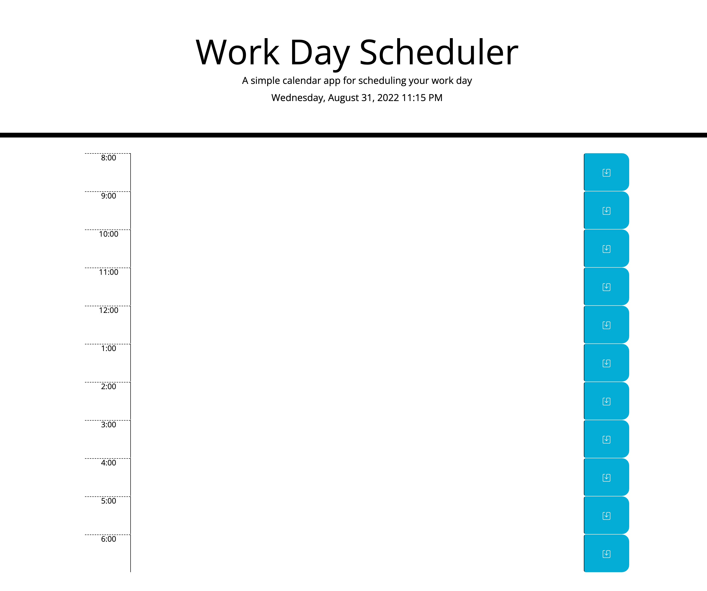

# Daily Scheduler

## Purpose

To generated a daily calendar that allows an employee to display important events to manage their time effectively.

## Requirements

The employee must be presented with:

- The current day is displayed.
- The current business hours are displayed.
- Time blocks are color coded for past, present, and future events.
- The time block can be edited with custom text content.
- The task item saved in the time block is saved and stored.

## Website

https://hartsfieldt.github.io/organizedpeople/

## Git Hub

https://github.com/hartsfieldt/organizedpeople

## Contribution

Made with ❤️ by Teresa Hartsfield
